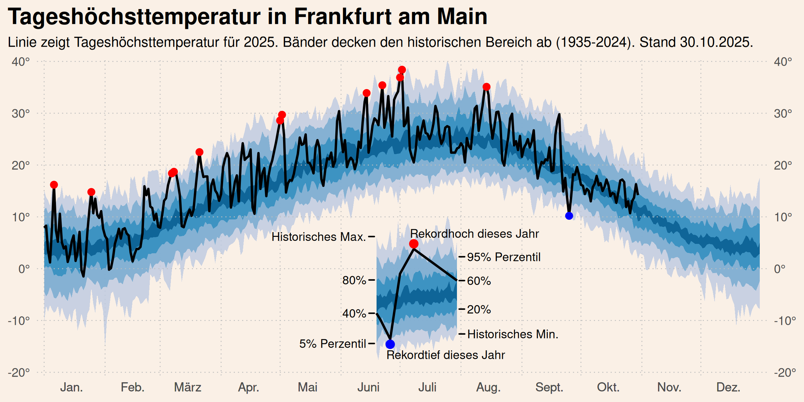

## Automatisierte Wettergrafiken im Tufte-Stil für Frankfurt am Main

Dieses Repository erstellt die untenstehenden Wettergrafiken (inspiriert von [Edward Tufte](https://www.edwardtufte.com/bboard/q-and-a-fetch-msg?msg_id=00014g) und [jdjohn215](https://github.com/jdjohn215/milwaukee-weather)). Aktualisierte Daten werden direkt vom Deutschen Wetterdienstes (DWD) bezogen und lokal gespeichert. Der gesamte Prozess wird mithilfe von Github Actions automatisiert.




## Über diese Daten

Die Daten stammen vom Deutschen Wetterdienstes (DWD), das historische tägliche Klimadaten für zahlreiche Wetterstationen in Deutschland bereitstellt. Für dieses Repository werden die Daten der Station **Frankfurt/Main (Stations-ID: 1420)** verwendet.

## Daten für eine andere Station abrufen

Der DWD stellt Daten für viele Wetterstationen in Deutschland bereit. Jede Station hat eine eindeutige Stations-ID. Dieses Repository verwendet die Daten der DWD-Station **Frankfurt/Main** mit der **Stations-ID 1420**.

Um Daten für eine andere Station zu verwenden:

1. Finden Sie die gewünschte Stations-ID über das [DWD CDC Portal](https://cdc.dwd.de/portal/) oder die [Stationslisten](https://opendata.dwd.de/climate_environment/CDC/observations_germany/climate/daily/kl/historical/KL_Tageswerte_Beschreibung_Stationen.txt).
2. Passen Sie den Stationsnamen (oder die ID) im Skript `R/Retrieve_dwd.R` an.

Das Skript `R/Retrieve_dwd.R` lädt die historischen und kürzlichen Tagesdaten (`*.zip`) für die angegebene Station vom DWD FTP-Server herunter (gespeichert in `data/dwd_raw/`), verarbeitet diese und speichert die kombinierten, bereinigten Klimadaten als CSV-Datei unter `data/clim_clean.csv`.

## Grafik replizieren oder anpassen

Die Grafiken werden aus der Datei `data/clim_clean.csv` generiert:

- Die Grafik `graphs/DailyHighTemp_dwd.png` wird durch das Skript `R/BuildDailyHigh_dwd.R` erstellt.
- Die Grafik `graphs/AnnualCumulativePrecipitation_dwd.png` wird durch das Skript `R/BuildCumulativePrecipitation_dwd.R` erstellt.

## Automatische Aktualisierung mit Github Actions

Der automatisierte Workflow in [/.github/workflows](/.github/workflows) führt regelmäßig folgende Schritte aus:

1. Erstellt neue R Umgebung und installiert die benötigten Pakete aus dem lockfile mit `renv`.
2. Führt das Skript `R/Retrieve_dwd.R` aus, um die DWD-Daten herunterzuladen und `data/clim_clean.csv` zu aktualisieren.
3. Führt die Skripte `R/BuildDailyHigh_dwd.R` und `R/BuildCumulativePrecipitation_dwd.R` aus, um die Grafiken im `graphs/`-Ordner neu zu erstellen.
4. Committet die aktualisierte CSV-Datei (`data/clim_clean.csv`) und die neuen Grafiken (`graphs/*.png`) in das Repository.

Der gesamte Vorgang dauert pro Durchlauf typischerweise etwa 1-2 Minuten.

## Sonstiges

Das `rdwd` Paket muss in der aktuellsten Version verwendet werden. Ansonsten kann es Probleme beim Download geben. Daher sollte entweder direkt die Version von GitHub installiert werden (`pak::pak("brry/rdwd")` oder `remotes::install_github("brry/rdwd")`) oder der Updater via `rdwd::updateRdwd()` genutzt werden. Wenn `renv` verwendet wird, sollte die aktuellste Version automatisch installiert werden.

Zum clonen des Repositories kann
```bash
git clone --depth 1 git@github.com:EinMaulwurf/r-weather-graph.git
```
verwendet werden, dadurch werden nicht alle commits geclont. Durch die täglichen commits der Abbildungen wird das Repository nämlich mit der Zeit ziemlich groß.
